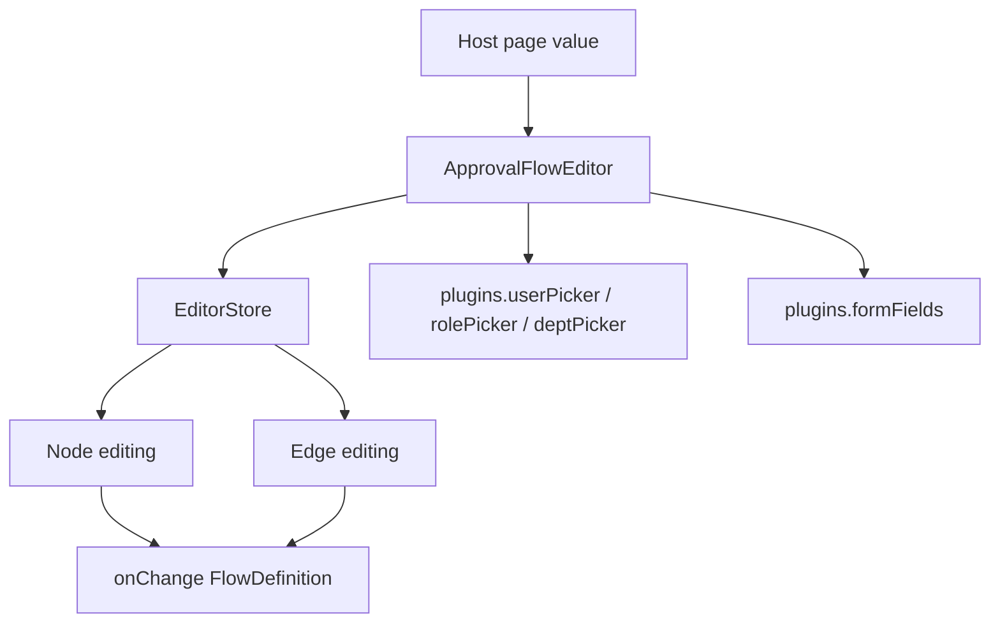

# Approval Flow Editor Plugin System

`@vef-framework-react/approval-flow-editor` is an independent business component package.  
Its most important host-side integration point is the `plugins` prop rather than styling.

## Basic Usage

```tsx
import type { FlowDefinition } from "@vef-framework-react/approval-flow-editor";

import { ApprovalFlowEditor } from "@vef-framework-react/approval-flow-editor";

const [definition, setDefinition] = useState<FlowDefinition>(initialValue);

<ApprovalFlowEditor
  value={definition}
  plugins={{
    formFields: [
      { key: "amount", kind: "number", label: "Amount" }
    ]
  }}
  onChange={setDefinition}
/>;
```

## What `plugins` Can Inject

`EditorPlugins` currently supports:

- `userPicker`
- `rolePicker`
- `deptPicker`
- `formFields`

## Typical Data Flow



## Serialization Helpers

When conversion is needed between the backend payload format and the editor-internal shape:

- `fromFlowDefinition`
- `toFlowDefinition`

These helpers are useful for:

- editor initialization
- save-time normalization
- local draft persistence
