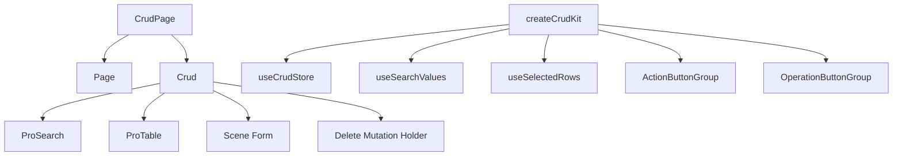

# CRUD Pages

One of the most productive parts of `@vef-framework-react/components` is the combination of `CrudPage` and `createCrudKit()`.  
The goal is not only to reduce table boilerplate, but to standardize search, list loading, form scenes, delete flows, batch actions, and page-local state.

## What a CRUD Page Combines



## Minimal `CrudPage` Example

```tsx
<CrudPage
  rowSelection
  basicSearch={<BasicSearch />}
  columnSettings={{ storageKey: "page.auth.user" }}
  deleteManyMutationFn={deleteUsers}
  deleteMutationFn={deleteUser}
  queryFn={findUserPage}
  renderForm={scene => <Form scene={scene} />}
  rowKey="id"
  tableColumns={tableColumns}
  formMutationFns={{
    create: createUser,
    update: updateUser
  }}
  sceneDefaultFormValues={{
    create: { isActive: true, isLocked: false }
  }}
/>
```

## When `CrudPage` Fits Best

`CrudPage` is usually a good fit when a page combines:

- list queries
- search areas
- create or update forms
- single-row delete
- batch operations

If the page is only a read-only table, `ProTable` is often enough.

## Common Props

| Prop | Purpose |
| --- | --- |
| `queryFn` | list query function |
| `tableColumns` | table columns |
| `rowKey` | row key |
| `basicSearch` | basic search area |
| `advancedSearch` | advanced search area |
| `renderForm` | render form by scene |
| `formMutationFns` | submit functions by scene |
| `deleteMutationFn` | single delete |
| `deleteManyMutationFn` | batch delete |
| `toolbarActions` | toolbar actions |
| `operationColumn` | row action column |
| `sceneDefaultFormValues` | default values by scene |

## Why `renderForm(scene)` Matters

CRUD forms rarely have only one shape. Create and update flows usually differ in small but important ways:

- password required on create but optional on update
- defaults applied only on create
- some fields disabled on update

That is why the form is rendered by scene:

```tsx
renderForm={scene => <Form scene={scene} />}
```

## Why `createCrudKit()` Matters

`createCrudKit()` locks a page's own generic types into a reusable local toolkit:

```ts
import { createCrudKit } from "@vef-framework-react/components";

export const {
  useCrudStore,
  useSearchValues,
  useSelectedRows,
  OperationButtonGroup,
  ActionButtonGroup
} = createCrudKit<User, UserSearch, UserFormSceneValues>();
```

After that:

- search components can read strongly typed search values
- toolbar buttons can access selected rows directly
- row operation columns can access `openForm`, `delete`, and `refetchQuery`

## Reuse Strategy

The most reusable pieces are usually:

- the page query function
- the page-local `createCrudKit()` result
- the search component
- the form component

This keeps pages consistent without making them overly rigid.
