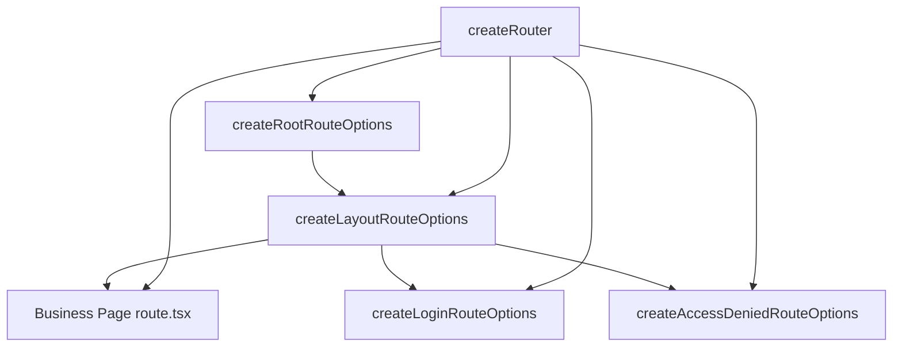

# Routing

VEF routing is built on top of `@tanstack/react-router`, but the APIs used most often in application code come from `@vef-framework-react/starter`:

- `createRouter()`
- `createRootRouteOptions()`
- `createLayoutRouteOptions()`
- `createLoginRouteOptions()`
- `createAccessDeniedRouteOptions()`

These helpers standardize concerns that appear repeatedly in admin applications: page titles, login redirects, permission checks, menu wiring, and default error states.

## Typical Route Structure



## What `createRouter()` Covers

The top-level router instance is usually created like this:

```ts
import { createRouter } from "@vef-framework-react/starter";

import { routeTree } from "./router.gen";
import { routerContext } from "./context";

const router = createRouter({
  history: "browser",
  routeTree,
  context: routerContext
});
```

It already wires:

- `hash` / `browser` history creation
- global pending / error / not-found components
- route transition progress handling
- default error notifications
- tab state synchronization
- automatic response to unauthenticated and access-denied events

## What Goes into `RouterContext`

The framework currently expects `RouterContext` to include at least:

```ts
interface RouterContext {
  router: AnyRouter;
  routeTitle?: string;
}
```

In most projects, a placeholder object is defined first:

```ts
import type { RouterContext } from "@vef-framework-react/starter";

export const routerContext: RouterContext = {
  router: undefined!
};
```

## Root Route: `createRootRouteOptions()`

The root route computes the document title from route context and menu metadata.

```tsx
import type { RouterContext } from "@vef-framework-react/starter";

import { createRootRouteWithContext } from "@tanstack/react-router";
import { createRootRouteOptions } from "@vef-framework-react/starter";

export const Route = createRootRouteWithContext<RouterContext>()(
  createRootRouteOptions({
    appTitle: "VEF Demo"
  })
);
```

## Layout Route: `createLayoutRouteOptions()`

The layout route is the core of the VEF routing layer. Authenticated admin pages usually sit under this route.

```tsx
import type { UserInfo } from "@vef-framework-react/starter";

import { createFileRoute } from "@tanstack/react-router";
import { createLayoutRouteOptions, INDEX_ROUTE_ID } from "@vef-framework-react/starter";

import { apiClient } from "../../api";
import { getUserInfo, logout } from "../../apis/auth";

async function handleLogout(): Promise<void> {
  await apiClient.executeMutation({ mutationFn: logout });
}

function fetchUserInfo(): Promise<UserInfo> {
  return apiClient.fetchQuery({
    queryKey: [getUserInfo.key, { appId: "admin" }],
    queryFn: getUserInfo
  });
}

export const Route = createFileRoute(INDEX_ROUTE_ID)(
  createLayoutRouteOptions({
    title: "Admin System",
    onLogout: handleLogout,
    fetchUserInfo
  })
);
```

This handles:

1. authentication checks
2. user-info and menu loading
3. writing menu state and permission tokens into `useAppStore`
4. redirecting unauthorized pages

## Login Route: `createLoginRouteOptions()`

```tsx
import { createFileRoute } from "@tanstack/react-router";
import { createLoginRouteOptions, LOGIN_ROUTE_ID } from "@vef-framework-react/starter";

import { apiClient } from "../../api";
import { login } from "../../apis/auth";

export const Route = createFileRoute(LOGIN_ROUTE_ID)(
  createLoginRouteOptions({
    onLogin: params => apiClient.executeMutation({ mutationFn: login, params })
  })
);
```

## Access-Denied Route: `createAccessDeniedRouteOptions()`

```tsx
import { createFileRoute } from "@tanstack/react-router";
import { ACCESS_DENIED_ROUTE_ID, createAccessDeniedRouteOptions } from "@vef-framework-react/starter";

export const Route = createFileRoute(ACCESS_DENIED_ROUTE_ID)(
  createAccessDeniedRouteOptions()
);
```

## Recommended Usage

- Keep the root route focused on document titles and top-level shell concerns.
- Let the layout route own authentication, menus, permissions, and user loading.
- Keep page routes focused on page behavior.
- Prefer the framework event chain for unauthenticated and access-denied redirects instead of scattering manual `navigate()` calls across pages.
