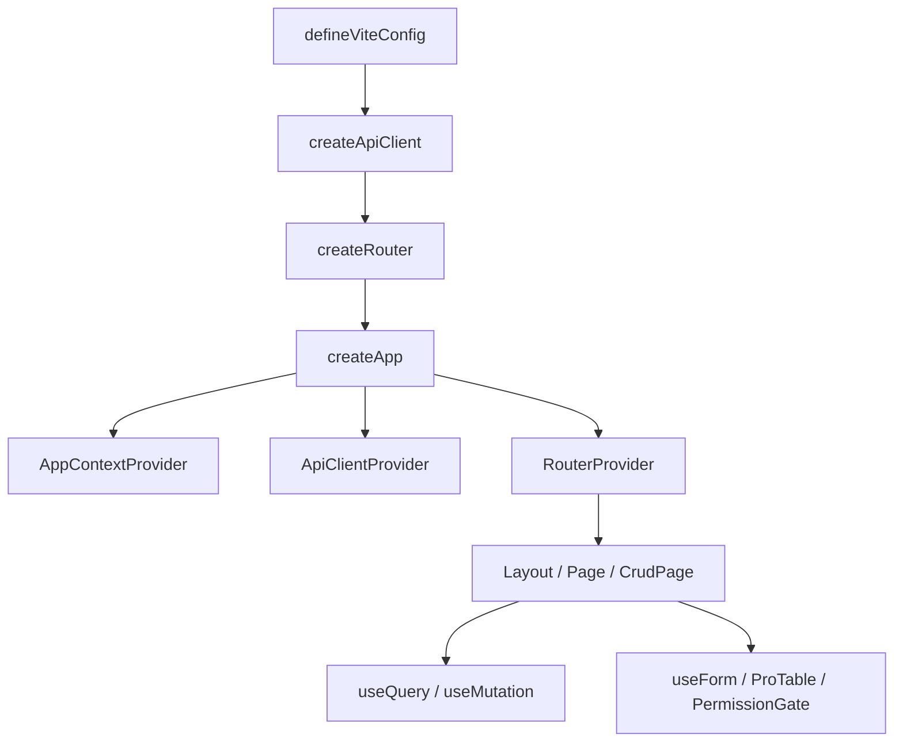

# VEF Framework React

VEF Framework React is a React solution for internal platforms, admin systems, and other enterprise-facing applications. It is not only a component library or a scaffold. Instead, it brings application bootstrap, routing, API integration, permissions, CRUD pages, forms, state management, and UI building blocks under one consistent API surface.

This documentation focuses on one thing: **how to build applications with the framework's exported APIs**.  
The repository also includes a sample application, `playground`, which can be used as a reference for application structure and page composition.

## Reading Order

The following order works well for most readers:

1. [Installation](./getting-started/installation.md)
2. [Quick Start](./getting-started/quick-start.md)
3. [Configuration](./getting-started/configuration.md)
4. [Project Structure](./getting-started/project-structure.md)
5. [Application Project Conventions](./getting-started/application-project-conventions.md)
6. [Routing](./guide/routing.md)
7. [API Integration](./guide/api-integration.md)
8. [Forms](./guide/forms.md)
9. [Tables](./guide/tables.md) and [CRUD Pages](./guide/crud.md)

## Package Overview

| Package | When You Reach for It | Common Exports |
| --- | --- | --- |
| `@vef-framework-react/starter` | Application bootstrap, routing, login pages, layouts, and CRUD pages | `createApp`, `createRouter`, `createApiClient`, `CrudPage`, `Page`, `ProTable` |
| `@vef-framework-react/components` | Page UI, forms, tables, notifications, icons, and charts | `Button`, `Table`, `useForm`, `useDataOptionsSelect`, `PermissionGate`, `Chart` |
| `@vef-framework-react/core` | Requests, query, stores, atoms, permission checks, and SSE | `ApiClient`, `useQuery`, `useMutation`, `createStore`, `createComponentStore`, `atom` |
| `@vef-framework-react/hooks` | Page-level helper hooks | `useDataDictQuery`, `useHasMutating`, `useAuthorizedItems`, `useDebouncedValue` |
| `@vef-framework-react/shared` | Common types, validation, formatting, tree utilities, and event emitters | `z`, `EventEmitter`, `formatDate`, `flattenTree`, `withPinyin` |
| `@vef-framework-react/dev` | Vite, ESLint, Stylelint, and Commitlint configuration | `defineViteConfig`, `defineEslintConfig`, `defineStylelintConfig`, `defineCommitlintConfig` |
| `@vef-framework-react/approval-flow-editor` | Approval flow design inside business applications | `ApprovalFlowEditor`, `toFlowDefinition`, `fromFlowDefinition` |

## Typical Application Composition

In most projects, the application flow looks like this:

1. Use `@vef-framework-react/dev` to establish the build and linting baseline.
2. Use `@vef-framework-react/starter` to assemble the application entry, router, and layouts.
3. Use `@vef-framework-react/core` to define request functions, state containers, and query logic.
4. Use `@vef-framework-react/components` and `@vef-framework-react/hooks` to build pages.
5. Use `@vef-framework-react/shared` for validation, formatting, and data transformation.

## Recommended Development Style

VEF works best when code is organized around page scenarios rather than around isolated technical layers.

Typical organization looks like this:

- Each page directory has a `route.tsx` entry.
- Page-specific queries, search forms, modal forms, and table columns stay close to the page.
- Domain APIs live under `apis/*` and are exposed through `apiClient.createQueryFn()` / `createMutationFn()`.
- Shared application infrastructure is handled by `starter` and `dev`, so business pages can stay focused.

## Sample Application Reference Points

The sample application includes representative examples for:

- `src/main.ts`: the `createApp().render()` entry point
- `src/api/index.ts`: standard `createApiClient()` configuration
- `src/pages/__root.ts`: root route setup with `createRootRouteOptions()`
- `src/pages/_layout/route.ts`: layout and guard setup with `createLayoutRouteOptions()`
- `src/pages/_layout/auth/user/route.tsx`: a typical `CrudPage` implementation
- `src/pages/_layout/auth/user/components/form.tsx`: a typical `useFormContext()` + `AppField` form
- `src/pages/_layout/sys/approval-flow-editor/route.tsx`: host integration for the approval flow editor

## Documentation Notes

- Example code is based on the current public API surface and follows the same structural patterns used in the sample application.
- Unless otherwise noted, examples only use publicly exported framework APIs.
- The documentation focuses on how APIs are combined in application code, rather than on internal implementation details.
