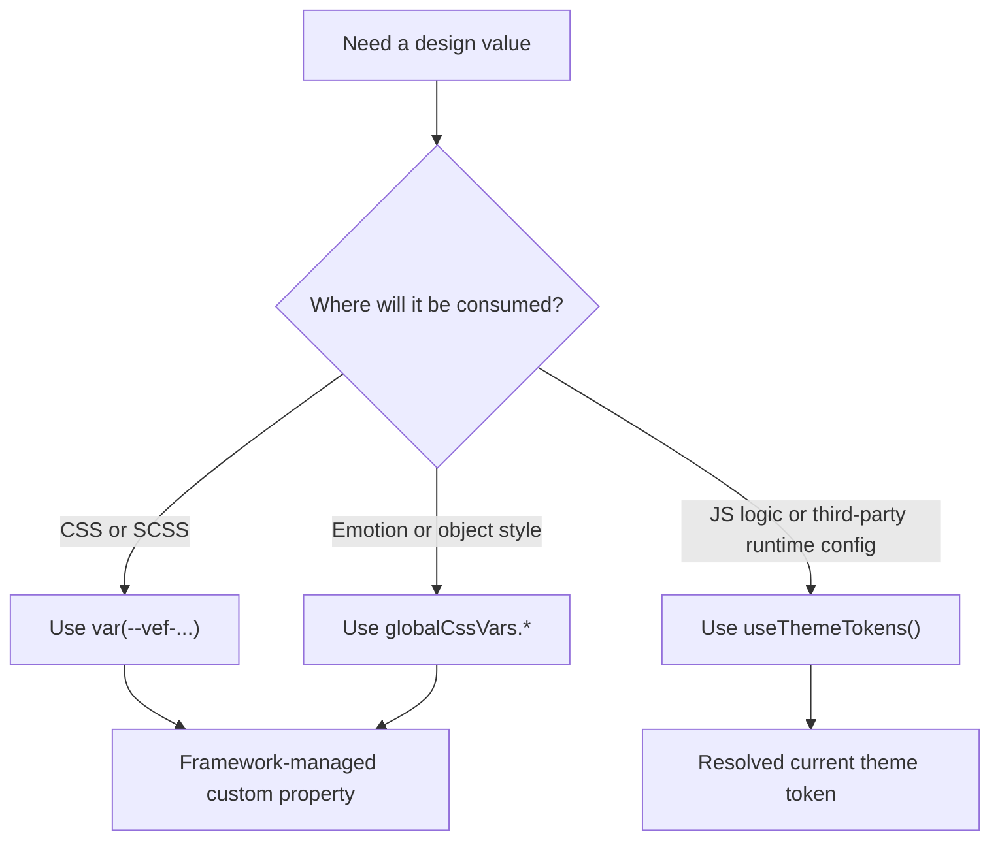

import {
  CatalogSection,
  groupedSections,
  uncategorizedVariables,
  variables,
  VarTable
} from "@site/src/components/css-variable-catalog";

# CSS Variables Reference

This page documents the VEF CSS custom properties intended for day-to-day styling work. It covers {variables.length} variables and focuses on the usage contract: which token family to reach for, where to read it from, and how to keep page styles aligned with the framework.

:::tip
If your app is bootstrapped through `starter.createApp().render()`, these variables are already injected onto `:root`. If you mount the component layer manually, keep `@vef-framework-react/components` `ConfigProvider` in place so the global variables are emitted.
:::

:::note
The values below reflect the default theme output. Theme overrides and dark mode can change semantic tokens such as `--vef-color-primary*`, surface tokens, and text tokens. Build against the variable names, not against the sample hex values.
:::

## Choosing the right entry point

VEF exposes the same design language through three different access paths:

- Use raw CSS variables such as `var(--vef-color-primary)` in CSS Modules, SCSS, third-party stylesheet overrides, or MDX snippets.
- Use `globalCssVars` in Emotion and other JS object styles when you want the same token without repeating string literals.
- Use `useThemeTokens()` when a value must be consumed in JavaScript logic or passed to a library that expects a resolved color or size value at render time.



## Recommended usage patterns

| Need | Prefer | Why |
| --- | --- | --- |
| Page spacing, card padding, and section rhythm | `--vef-spacing-*`, `--vef-padding-*`, `--vef-margin-*` | Keeps layout rhythm consistent with framework components. |
| Primary actions, links, and selected states | `--vef-color-primary`, `--vef-color-primary-hover`, `--vef-color-primary-active`, `--vef-color-primary-text` | Stays aligned with theme overrides and dark-mode behavior. |
| Neutral panels, cards, and page chrome | `--vef-color-bg-container`, `--vef-color-bg-layout`, `--vef-color-border`, `--vef-shadow-*`, `--vef-border-radius*` | Matches the framework shell and default component surfaces. |
| Muted, secondary, and descriptive text | `--vef-color-text`, `--vef-color-text-secondary`, `--vef-color-text-tertiary`, `--vef-color-text-description` | Avoids ad-hoc opacity tuning and keeps contrast consistent. |
| Validation and status messaging | `--vef-color-success-*`, `--vef-color-warning-*`, `--vef-color-error-*`, `--vef-color-info-*` | Gives you matching background, border, and text states out of the box. |
| Charts, illustrations, and multicolor accents | `--vef-color-blue-50..950`, `--vef-color-emerald-50..950`, or the preset `--vef-blue-1..10` style families | Provides broader ramps than semantic status tokens. |
| CSS-in-JS styles written in TS/JS | `globalCssVars.*` | Avoids repeating raw `var(--vef-...)` strings in Emotion objects. |

## Raw CSS variable usage

Use raw variables when your style lives directly in CSS, SCSS, or a CSS Module.

```scss
.configItem {
  display: flex;
  gap: var(--vef-spacing-xl);
  padding: var(--vef-spacing-lg) var(--vef-spacing-xl);
  background: var(--vef-color-bg-container);
  border: 1px solid var(--vef-color-border-secondary);
  border-radius: var(--vef-border-radius-lg);
  box-shadow: var(--vef-shadow-sm);
}

.configItem:hover {
  background: var(--vef-color-fill-quaternary);
}
```

This is the best default for:

- CSS Modules used by page routes
- SCSS files that restyle framework components
- MDX examples and site-level styles
- CSS authored for third-party widgets that do not know about `globalCssVars`

## `globalCssVars` in Emotion or object styles

`globalCssVars` is the JS/TS alias layer exported by `@vef-framework-react/components`. It maps CSS variable names into camelCase fields, for example:

| CSS custom property | JS alias |
| --- | --- |
| `var(--vef-color-primary)` | `globalCssVars.colorPrimary` |
| `var(--vef-spacing-md)` | `globalCssVars.spacingMd` |
| `var(--vef-border-radius-lg)` | `globalCssVars.borderRadiusLg` |
| `var(--vef-font-family-code)` | `globalCssVars.fontFamilyCode` |

```tsx
import { css } from "@emotion/react";
import { globalCssVars } from "@vef-framework-react/components";

const panelStyle = css({
  padding: globalCssVars.spacingMd,
  borderRadius: globalCssVars.borderRadiusLg,
  border: `1px solid ${globalCssVars.colorBorderSecondary}`,
  backgroundColor: globalCssVars.colorBgContainer,
  boxShadow: globalCssVars.shadowSm
});
```

Use this when your style already lives in TS or JS. It keeps the token name consistent with the framework while avoiding raw string repetition.

## `useThemeTokens()` for runtime values

`useThemeTokens()` returns the resolved Ant Design token object for the current theme. Reach for it when a runtime library needs concrete values rather than CSS variable strings.

```tsx
import { useThemeTokens } from "@vef-framework-react/components";

export function MetricsChart() {
  const { colorPrimary, colorTextSecondary } = useThemeTokens();

  return (
    <MyChart
      palette={[colorPrimary, colorTextSecondary]}
    />
  );
}
```

Typical cases:

- chart libraries configured from JS
- canvas drawing
- runtime color calculations
- conditional logic based on current theme output

## Naming model

The variable catalog is easier to navigate once the families are clear:

- `--vef-color-primary-*`, `--vef-color-success-*`, and similar semantic ramps are the first choice for meaning-driven styling.
- `--vef-color-blue-*`, `--vef-color-emerald-*`, and other extended ramps are useful when you need a named color family rather than a semantic intent.
- `--vef-blue-1..10`, `--vef-purple-1..10`, and similar preset scales follow the Ant Design-style palette numbering.
- `--vef-color-text*`, `--vef-color-bg*`, `--vef-color-fill*`, and `--vef-color-border*` are neutral UI surface tokens.
- `--vef-spacing-*`, `--vef-padding-*`, `--vef-margin-*`, `--vef-border-radius*`, and `--vef-shadow-*` are layout and elevation primitives.

:::info
This page focuses on global design tokens. Component-scoped override variables such as `--vef-card-body-padding` are still valid when a component documents them, but they are not part of this shared global token catalog.
:::

## Full catalog

{groupedSections.map(section => (
  <CatalogSection
    key={section.id}
    defaultOpen={section.defaultOpen}
    description={section.description}
    items={section.items}
    title={section.title}
  />
))}

{uncategorizedVariables.length > 0 && (
  <>
    ## Uncategorized

    <VarTable items={uncategorizedVariables} />
  </>
)}
