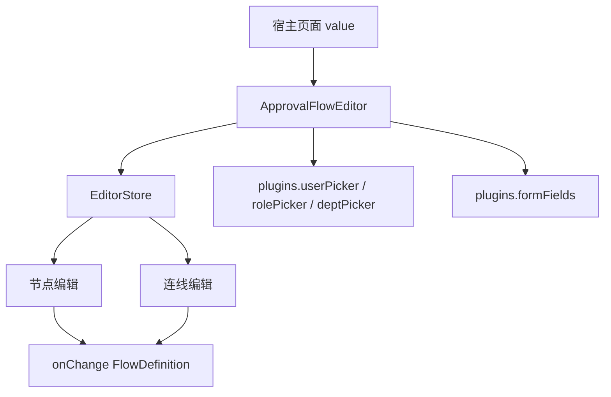

# 审批流编辑器插件系统

`@vef-framework-react/approval-flow-editor` 是一个独立业务组件包。  
它最重要的宿主集成点不是样式，而是 `plugins`。

## 基本用法

```tsx
import type { FlowDefinition } from "@vef-framework-react/approval-flow-editor";

import { ApprovalFlowEditor } from "@vef-framework-react/approval-flow-editor";

const [definition, setDefinition] = useState<FlowDefinition>(initialValue);

<ApprovalFlowEditor
  value={definition}
  plugins={{
    formFields: [
      { key: "amount", kind: "number", label: "金额" }
    ]
  }}
  onChange={setDefinition}
/>;
```

## `plugins` 能注入什么

`EditorPlugins` 当前支持:

- `userPicker`
- `rolePicker`
- `deptPicker`
- `formFields`

## 典型数据流



## 序列化能力

如果你需要在后端格式和编辑器内部格式之间转换，可以用:

- `fromFlowDefinition`
- `toFlowDefinition`

这两个 API 很适合:

- 初始化编辑器
- 保存前归一化
- 做本地草稿存储
