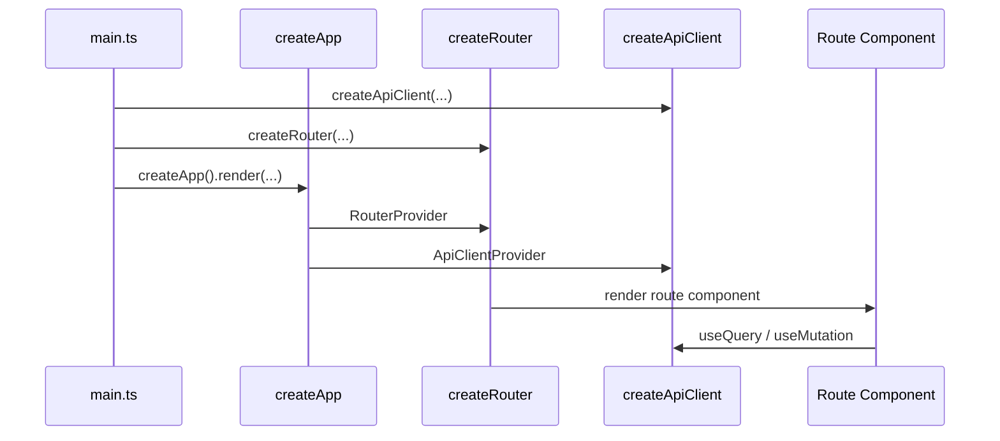

# 快速开始

这一节展示一套最小但真实的 VEF 应用骨架。读完后可以建立以下几项基础认知:

1. 应用入口怎么写
2. `apiClient` 怎么建
3. `router` 怎么建
4. 页面如何拿到框架能力

## 最小可运行链路



## 第一步: 配置 Vite

```ts title="vite.config.ts"
import { defineViteConfig } from "@vef-framework-react/dev";

export default defineViteConfig({
  react: {
    useCompiler: true
  }
});
```

## 第二步: 创建 API 客户端

`starter` 提供的 `createApiClient()` 已经帮你把 token 存储、未认证处理、权限不足处理以及消息通知接好了。  
业务项目里通常只需要补 HTTP 相关配置。

```ts title="src/api/index.ts"
import { createApiClient } from "@vef-framework-react/starter";

export const apiClient = createApiClient({
  http: {
    baseUrl: import.meta.env.VITE_API_BASE_URL,
    okCode: 0,
    tokenExpiredCode: 1002,
    timeout: 30_000,
    async refreshToken(tokens) {
      const response = await fetch("/api/auth/refresh", {
        method: "POST",
        headers: { "Content-Type": "application/json" },
        body: JSON.stringify({ refreshToken: tokens.refreshToken })
      });

      return await response.json();
    }
  },
  query: {
    staleTime: 60_000,
    gcTime: 10 * 60_000
  }
});
```

## 第三步: 声明请求函数

VEF 推荐通过 `apiClient.createQueryFn()` 和 `apiClient.createMutationFn()` 暴露业务 API。

```ts title="src/apis/auth.ts"
import type { AuthTokens } from "@vef-framework-react/core";
import type { LoginParams } from "@vef-framework-react/starter";

import { apiClient } from "../api";

export const login = apiClient.createMutationFn(
  "login",
  http => async (params: LoginParams) => {
    const result = await http.post<AuthTokens>("/api/login", {
      data: params
    });

    return {
      message: result.message,
      tokens: result.data
    };
  }
);
```

## 第四步: 创建根路由和布局路由

```tsx title="src/pages/__root.tsx"
import type { RouterContext } from "@vef-framework-react/starter";

import { createRootRouteWithContext } from "@tanstack/react-router";
import { createRootRouteOptions } from "@vef-framework-react/starter";

export const Route = createRootRouteWithContext<RouterContext>()(
  createRootRouteOptions({
    appTitle: "VEF Demo"
  })
);
```

```tsx title="src/pages/_layout/route.tsx"
import type { UserInfo } from "@vef-framework-react/starter";

import { createFileRoute } from "@tanstack/react-router";
import { createLayoutRouteOptions, INDEX_ROUTE_ID } from "@vef-framework-react/starter";

import { apiClient } from "../api";
import { getUserInfo, logout } from "../apis/auth";

async function handleLogout(): Promise<void> {
  await apiClient.executeMutation({
    mutationFn: logout
  });
}

function fetchUserInfo(): Promise<UserInfo> {
  return apiClient.fetchQuery({
    queryKey: [getUserInfo.key, { appId: "admin" }],
    queryFn: getUserInfo
  });
}

export const Route = createFileRoute(INDEX_ROUTE_ID)(
  createLayoutRouteOptions({
    title: "VEF Demo",
    onLogout: handleLogout,
    fetchUserInfo
  })
);
```

## 第五步: 登录路由与拒绝访问路由

```tsx title="src/pages/_common/login.tsx"
import { createFileRoute } from "@tanstack/react-router";
import { createLoginRouteOptions, LOGIN_ROUTE_ID } from "@vef-framework-react/starter";

import { apiClient } from "../api";
import { login } from "../apis/auth";

export const Route = createFileRoute(LOGIN_ROUTE_ID)(
  createLoginRouteOptions({
    onLogin: params => apiClient.executeMutation({ mutationFn: login, params })
  })
);
```

```tsx title="src/pages/_common/access-denied.tsx"
import { createFileRoute } from "@tanstack/react-router";
import { ACCESS_DENIED_ROUTE_ID, createAccessDeniedRouteOptions } from "@vef-framework-react/starter";

export const Route = createFileRoute(ACCESS_DENIED_ROUTE_ID)(
  createAccessDeniedRouteOptions()
);
```

## 第六步: 创建 router

```ts title="src/router/context.ts"
import type { RouterContext } from "@vef-framework-react/starter";

export const routerContext: RouterContext = {
  router: undefined!
};
```

```ts title="src/router/index.ts"
import { createRouter } from "@vef-framework-react/starter";

import { routeTree } from "./routeTree.gen";
import { routerContext } from "./context";

const router = createRouter({
  history: "browser",
  routeTree,
  context: routerContext
});

export default router;
```

## 第七步: 渲染应用

```ts title="src/main.ts"
import { createApp } from "@vef-framework-react/starter";

import { apiClient } from "./api";
import router from "./router";

createApp().render({
  apiClient,
  router,
  appContext: {
    hasPermission(token) {
      return token.startsWith("demo:");
    },
    dataDictQueryFn: undefined,
    fileBaseUrl: "/files"
  },
  appVersionNotification: {
    enabled: import.meta.env.PROD,
    checkInterval: 10 * 60
  }
});
```

## 第八步: 写一个真实页面

```tsx title="src/pages/_layout/index/route.tsx"
import { createFileRoute } from "@tanstack/react-router";
import { Button, Card, Text } from "@vef-framework-react/components";
import { useQuery } from "@vef-framework-react/core";
import { Page } from "@vef-framework-react/components";

import { getDashboard } from "../../../apis/dashboard";

export const Route = createFileRoute("/_layout/")({
  component: RouteComponent
});

function RouteComponent() {
  const dashboard = useQuery({
    queryKey: [getDashboard.key],
    queryFn: getDashboard
  });

  return (
    <Page title="首页">
      <Card>
        <Text>{dashboard.data?.message ?? "欢迎使用 VEF"}</Text>
        <Button type="primary">开始开发</Button>
      </Card>
    </Page>
  );
}
```

## 后续阅读

可继续阅读:

1. [项目结构](./project-structure.md)
2. [工程配置](./configuration.md)
3. [路由](../guide/routing.md)
4. [API 集成](../guide/api-integration.md)
