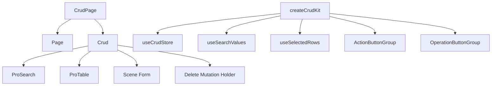

# CRUD 页面

`@vef-framework-react/components` 里最有生产力的 API 之一，就是 `CrudPage` 与 `createCrudKit()`。  
它们的目标不是让你“少写一个表格”，而是让列表页、搜索、弹窗表单、删除、批量操作和页面局部状态都走一条统一路径。

## 一页 CRUD 到底由哪些部分组成



## 最小 `CrudPage` 示例

用户管理类页面通常可以按下面的方式组织:

```tsx
<CrudPage
  rowSelection
  basicSearch={<BasicSearch />}
  columnSettings={{ storageKey: "page.auth.user" }}
  deleteManyMutationFn={deleteUsers}
  deleteMutationFn={deleteUser}
  queryFn={findUserPage}
  renderForm={scene => <Form scene={scene} />}
  rowKey="id"
  tableColumns={tableColumns}
  formMutationFns={{
    create: createUser,
    update: updateUser
  }}
  sceneDefaultFormValues={{
    create: { isActive: true, isLocked: false }
  }}
/>
```

## `CrudPage` 适合什么页面

当页面同时具备下面几项时，优先考虑 `CrudPage`:

- 列表查询
- 搜索区域
- 新增或编辑表单
- 单条删除
- 批量操作

如果页面只是“一个只读表格”，用 `ProTable` 就够了。

## 最常用的参数

| 参数 | 作用 |
| --- | --- |
| `queryFn` | 列表查询函数 |
| `tableColumns` | 表格列 |
| `rowKey` | 行主键 |
| `basicSearch` | 基础搜索区域 |
| `advancedSearch` | 高级搜索区域 |
| `renderForm` | 根据场景渲染表单 |
| `formMutationFns` | 不同场景的提交函数 |
| `deleteMutationFn` | 单条删除 |
| `deleteManyMutationFn` | 批量删除 |
| `toolbarActions` | 工具栏按钮 |
| `operationColumn` | 行级按钮列 |
| `sceneDefaultFormValues` | 各场景默认表单值 |

## `renderForm(scene)` 的意义

CRUD 表单不是固定只有一种形态。  
同一个页面里，新增和编辑通常会有细微差异，比如:

- 创建时密码必填，编辑时可选
- 创建时某些字段给默认值
- 编辑时部分字段禁用

所以 VEF 把表单渲染函数设计成:

```tsx
renderForm={scene => <Form scene={scene} />}
```

这样表单组件内部就能通过 `scene` 区分逻辑。

## `createCrudKit()` 为什么重要

`createCrudKit()` 负责把页面自己的泛型信息固定下来，避免你在很多局部组件里重复写类型参数。

```ts
import { createCrudKit } from "@vef-framework-react/components";

export const {
  useCrudStore,
  useSearchValues,
  useSelectedRows,
  OperationButtonGroup,
  ActionButtonGroup
} = createCrudKit<User, UserSearch, UserFormSceneValues>();
```

有了它之后:

- 搜索组件可以直接拿到强类型搜索值
- 工具栏按钮可以直接拿到当前选中行
- 操作列可以直接拿到 `openForm`、`delete`、`refetchQuery`

## 工具栏按钮怎么写

```tsx
toolbarActions={(
  <UserActionButtonGroup selector={state => [state.openForm, state.selectedRows, state.deleteMany, state.refetchQuery] as const}>
    {([openForm, selectedRows, deleteMany, refetchQuery]) => (
      <>
        <ActionButton onClick={() => openForm({ scene: "create" })}>
          新增
        </ActionButton>

        <ActionButton
          disabled={selectedRows.length === 0}
          onClick={async () => {
            await deleteMany(selectedRows);
            refetchQuery();
          }}
        >
          批量删除
        </ActionButton>
      </>
    )}
  </UserActionButtonGroup>
)}
```

## 行操作按钮怎么写

```tsx
operationColumn={{
  render(row) {
    return (
      <UserOperationButtonGroup selector={state => [state.openForm, state.delete, state.refetchQuery] as const}>
        {([openForm, deleteUser, refetchQuery]) => (
          <>
            <OperationButton onClick={() => openForm({ scene: "update", values: row })}>
              编辑
            </OperationButton>

            <OperationButton
              confirmable
              onClick={async () => {
                await deleteUser(row);
                refetchQuery();
              }}
            >
              删除
            </OperationButton>
          </>
        )}
      </UserOperationButtonGroup>
    );
  }
}}
```

## 实践建议

更适合复用的通常不是“通用 CRUD 页面组件”，而是:

- 页面的查询函数
- 页面的 `createCrudKit()` 结果
- 搜索组件
- 表单组件

这样页面既保持统一，也保留了足够的业务可定制性。
