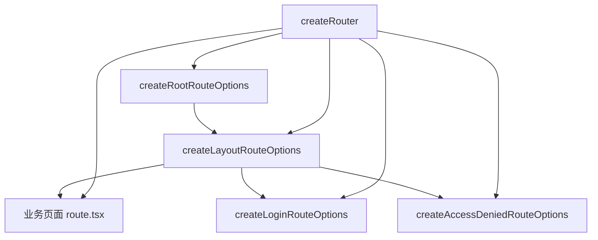

# 路由

VEF 的路由能力建立在 `@tanstack/react-router` 之上，但你平时真正高频使用的是 `@vef-framework-react/starter` 提供的一组辅助 API:

- `createRouter()`
- `createRootRouteOptions()`
- `createLayoutRouteOptions()`
- `createLoginRouteOptions()`
- `createAccessDeniedRouteOptions()`

这几组 API 的目标很明确: **把后台系统里反复出现的标题、登录跳转、权限校验、菜单装配和默认错误态统一起来**。

## 一条标准路由链路



## `createRouter()` 负责什么

最外层 router 实例通常这样创建:

```ts
import { createRouter } from "@vef-framework-react/starter";

import { routeTree } from "./router.gen";
import { routerContext } from "./context";

const router = createRouter({
  history: "browser",
  routeTree,
  context: routerContext
});
```

它帮你接好了这些默认行为:

- `hash` / `browser` history 的创建
- 全局 pending / error / not-found 组件
- 路由切换进度条
- 默认错误通知
- 标签页状态同步
- 监听“未认证”和“无权限”事件并自动跳转

## `RouterContext` 里应该放什么

当前框架约定的 `RouterContext` 至少包含:

```ts
interface RouterContext {
  router: AnyRouter;
  routeTitle?: string;
}
```

实际项目里通常会先给一个占位对象:

```ts
import type { RouterContext } from "@vef-framework-react/starter";

export const routerContext: RouterContext = {
  router: undefined!
};
```

## 根路由: `createRootRouteOptions()`

根路由的职责非常单纯: 根据当前路由上下文和菜单信息计算文档标题。

```tsx
import type { RouterContext } from "@vef-framework-react/starter";

import { createRootRouteWithContext } from "@tanstack/react-router";
import { createRootRouteOptions } from "@vef-framework-react/starter";

export const Route = createRootRouteWithContext<RouterContext>()(
  createRootRouteOptions({
    appTitle: "VEF Demo"
  })
);
```

## 布局路由: `createLayoutRouteOptions()`

布局路由是 VEF 路由层最关键的一层。  
你应该把“已登录后才能访问”的后台页面都挂在这里。

```tsx
import type { UserInfo } from "@vef-framework-react/starter";

import { createFileRoute } from "@tanstack/react-router";
import { createLayoutRouteOptions, INDEX_ROUTE_ID } from "@vef-framework-react/starter";

import { apiClient } from "../../api";
import { getUserInfo, logout } from "../../apis/auth";

async function handleLogout(): Promise<void> {
  await apiClient.executeMutation({ mutationFn: logout });
}

function fetchUserInfo(): Promise<UserInfo> {
  return apiClient.fetchQuery({
    queryKey: [getUserInfo.key, { appId: "admin" }],
    queryFn: getUserInfo
  });
}

export const Route = createFileRoute(INDEX_ROUTE_ID)(
  createLayoutRouteOptions({
    title: "后台系统",
    onLogout: handleLogout,
    fetchUserInfo
  })
);
```

它自动完成:

1. 登录态检查
2. 用户信息与菜单加载
3. 菜单树和权限点写入 `useAppStore`
4. 无权限页面跳转

## 登录路由: `createLoginRouteOptions()`

```tsx
import { createFileRoute } from "@tanstack/react-router";
import { createLoginRouteOptions, LOGIN_ROUTE_ID } from "@vef-framework-react/starter";

import { apiClient } from "../../api";
import { login } from "../../apis/auth";

export const Route = createFileRoute(LOGIN_ROUTE_ID)(
  createLoginRouteOptions({
    onLogin: params => apiClient.executeMutation({ mutationFn: login, params })
  })
);
```

## 权限不足路由: `createAccessDeniedRouteOptions()`

```tsx
import { createFileRoute } from "@tanstack/react-router";
import { ACCESS_DENIED_ROUTE_ID, createAccessDeniedRouteOptions } from "@vef-framework-react/starter";

export const Route = createFileRoute(ACCESS_DENIED_ROUTE_ID)(
  createAccessDeniedRouteOptions()
);
```

## 推荐实践

- 根路由只做标题与全局壳层托底。
- 布局路由只做登录态、菜单、权限和用户信息加载。
- 页面路由尽量只关心页面本身。
- 未认证和无权限跳转尽量走框架事件链，不要页面里散落 `navigate()`。
