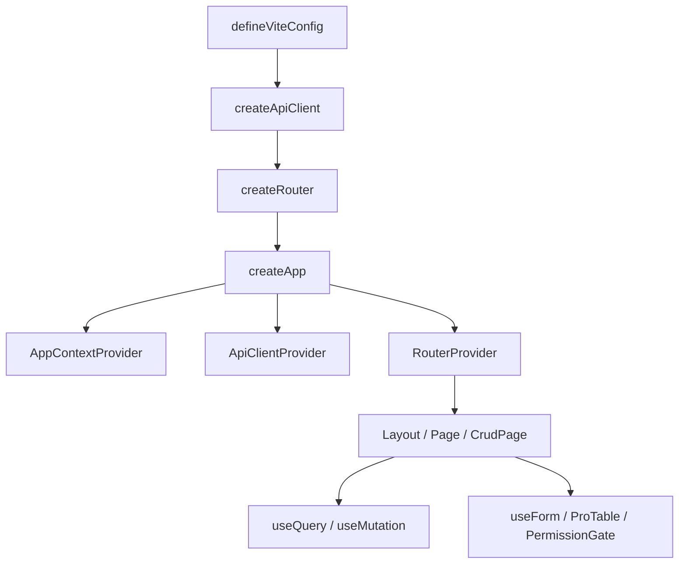

# VEF Framework React

VEF Framework React 是一套面向中后台与内部系统的 React 解决方案。它不是单独的 UI 库，也不是只做脚手架，而是把应用启动、路由、请求封装、权限、CRUD 页面、表单、状态管理和组件库放在了一套统一 API 下面。

本文档聚焦一件事: **如何使用框架导出的 API 来构建应用**。  
仓库中附带了示例应用 `playground`，可用于补充理解应用组织方式与页面组合方式。

## 阅读顺序

建议按以下顺序阅读:

1. [安装与依赖](./getting-started/installation.md)
2. [快速开始](./getting-started/quick-start.md)
3. [工程配置](./getting-started/configuration.md)
4. [推荐目录结构](./getting-started/project-structure.md)
5. [应用项目规范](./getting-started/application-project-conventions.md)
6. [路由](./guide/routing.md)
7. [API 集成](./guide/api-integration.md)
8. [表单](./guide/forms.md)
9. [表格与 CRUD](./guide/tables.md) 和 [CRUD 页面](./guide/crud.md)

## 包职责总览

| 包名 | 你什么时候会用它 | 常见导出 |
| --- | --- | --- |
| `@vef-framework-react/starter` | 搭应用骨架、路由、登录页、布局、CRUD 页面 | `createApp`、`createRouter`、`createApiClient`、`CrudPage`、`Page`、`ProTable` |
| `@vef-framework-react/components` | 写页面 UI、表单、表格、消息通知、图标、图表 | `Button`、`Table`、`useForm`、`useDataOptionsSelect`、`PermissionGate`、`Chart` |
| `@vef-framework-react/core` | 请求、query、store、atom、权限判断、SSE | `ApiClient`、`useQuery`、`useMutation`、`createStore`、`createComponentStore`、`atom` |
| `@vef-framework-react/hooks` | 页面层辅助 hooks | `useDataDictQuery`、`useHasMutating`、`useAuthorizedItems`、`useDebouncedValue` |
| `@vef-framework-react/shared` | 通用类型、校验、格式化、树处理、事件总线 | `z`、`EventEmitter`、`formatDate`、`flattenTree`、`withPinyin` |
| `@vef-framework-react/dev` | Vite / ESLint / Stylelint / Commitlint 配置 | `defineViteConfig`、`defineEslintConfig`、`defineStylelintConfig`、`defineCommitlintConfig` |
| `@vef-framework-react/approval-flow-editor` | 在业务系统中嵌入审批流设计器 | `ApprovalFlowEditor`、`toFlowDefinition`、`fromFlowDefinition` |

## 一个应用通常怎么拼起来

常见应用链路可以概括为:

1. 用 `@vef-framework-react/dev` 搭建工程配置。
2. 用 `@vef-framework-react/starter` 组装应用入口、路由和布局。
3. 用 `@vef-framework-react/core` 定义请求函数、状态容器和 query。
4. 用 `@vef-framework-react/components` 与 `@vef-framework-react/hooks` 写页面。
5. 用 `@vef-framework-react/shared` 处理校验、格式化和数据转换。

## 这套框架最适合的开发方式

VEF 更鼓励你按“页面场景”来组织代码，而不是按技术层硬拆。

推荐模式:

- 每个页面目录有一个 `route.tsx` 作为入口。
- 页面自己的查询、搜索表单、弹窗表单、表格列定义放在同目录。
- 领域 API 放在 `apis/*`，并通过 `apiClient.createQueryFn()` / `createMutationFn()` 暴露。
- 通用配置和工程能力交给 `starter` 与 `dev`，业务页面尽量不重复搭基础设施。

## 示例应用参考点

`playground` 中包含以下代表性场景:

- `src/main.ts`: `createApp().render()` 的真实入口。
- `src/api/index.ts`: `createApiClient()` 的标准配置方式。
- `src/pages/__root.ts`: `createRootRouteOptions()` 的根路由写法。
- `src/pages/_layout/route.ts`: `createLayoutRouteOptions()` 的布局守卫写法。
- `src/pages/_layout/auth/user/route.tsx`: `CrudPage` 的典型页面写法。
- `src/pages/_layout/auth/user/components/form.tsx`: `useFormContext()` 与 `AppField` 的典型表单写法。
- `src/pages/_layout/sys/approval-flow-editor/route.tsx`: 审批流编辑器的宿主集成方式。

## 文档说明

- 示例代码以当前框架的公开导出 API 为基础，并保持与示例应用中的组织方式一致。
- 除非特别说明，否则示例里的 API 都来自框架导出面。
- 本文档更关心“如何组合这些 API”，而不是解释框架内部如何实现。
