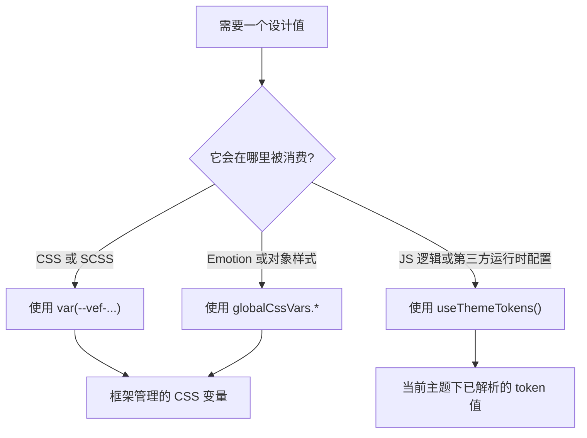

import {
  CatalogSection,
  groupedSections,
  uncategorizedVariables,
  variables,
  VarTable
} from "@site/src/components/css-variable-catalog";

# CSS 变量参考

这一页面向日常开发中的样式编写，集中说明 VEF 可直接使用的 CSS 自定义属性。当前共收录 {variables.length} 个变量，重点回答三个问题：应该优先选哪一类变量、应该从哪个入口读取，以及怎样让页面样式和框架整体视觉保持一致。

:::tip
如果应用是通过 `starter.createApp().render()` 启动的，这些变量会自动注入到 `:root`。如果你是手动挂载组件层，请保留 `@vef-framework-react/components` 的 `ConfigProvider`，这样全局变量才会正常输出。
:::

:::note
下面展示的是默认主题下的输出值。像 `--vef-color-primary*` 这类语义变量、表面色变量和文本变量，在主题覆盖或暗色模式下都可能变化。开发时请依赖变量名，而不是把这里的示例十六进制值当成固定常量。
:::

## 应该从哪个入口读取

VEF 通过三种入口暴露同一套设计语言：

- 在 CSS Modules、SCSS、第三方样式覆盖或 MDX 示例里，直接使用 `var(--vef-color-primary)` 这类原始 CSS 变量。
- 在 Emotion 或其他 JS 对象样式里，优先使用 `globalCssVars`，这样可以避免反复手写字符串。
- 当值需要参与 JavaScript 逻辑，或者要传给图表、canvas 等运行时库时，使用 `useThemeTokens()` 读取当前主题下已经解析好的值。



## 推荐使用方式

| 需求 | 推荐变量 | 原因 |
| --- | --- | --- |
| 页面间距、卡片内边距、区块节奏 | `--vef-spacing-*`、`--vef-padding-*`、`--vef-margin-*` | 能和框架组件的整体节奏保持一致。 |
| 主按钮、链接、选中态 | `--vef-color-primary`、`--vef-color-primary-hover`、`--vef-color-primary-active`、`--vef-color-primary-text` | 会自动跟随主题覆盖和暗色模式变化。 |
| 中性面板、卡片表面、页面底色 | `--vef-color-bg-container`、`--vef-color-bg-layout`、`--vef-color-border`、`--vef-shadow-*`、`--vef-border-radius*` | 能与框架外壳和默认组件表面保持统一。 |
| 次级文本、说明文本、弱化文本 | `--vef-color-text`、`--vef-color-text-secondary`、`--vef-color-text-tertiary`、`--vef-color-text-description` | 不需要自己再调透明度，整体层级更稳定。 |
| 校验状态和业务状态提示 | `--vef-color-success-*`、`--vef-color-warning-*`、`--vef-color-error-*`、`--vef-color-info-*` | 同时提供背景、边框和文本状态，组合起来更顺手。 |
| 图表、插画、多色强调 | `--vef-color-blue-50..950`、`--vef-color-emerald-50..950`，或 `--vef-blue-1..10` 这类预设色阶 | 色阶更完整，适合语义色之外的多彩表达。 |
| TS/JS 里的 CSS-in-JS 样式 | `globalCssVars.*` | 可以避免在对象样式里重复写原始 `var(--vef-...)` 字符串。 |

## 在 CSS 里直接使用变量

当样式写在 CSS、SCSS 或 CSS Module 中时，直接使用原始变量最自然。

```scss
.configItem {
  display: flex;
  gap: var(--vef-spacing-xl);
  padding: var(--vef-spacing-lg) var(--vef-spacing-xl);
  background: var(--vef-color-bg-container);
  border: 1px solid var(--vef-color-border-secondary);
  border-radius: var(--vef-border-radius-lg);
  box-shadow: var(--vef-shadow-sm);
}

.configItem:hover {
  background: var(--vef-color-fill-quaternary);
}
```

这种方式最适合：

- 页面路由下的 CSS Modules
- 对框架组件做样式覆盖的 SCSS 文件
- MDX 示例和站点级样式
- 不认识 `globalCssVars` 的第三方组件样式

## 在 Emotion 或对象样式里使用 `globalCssVars`

`globalCssVars` 是 `@vef-framework-react/components` 导出的 JS/TS 别名层。它把 CSS 变量映射成 camelCase 字段，例如：

| CSS 自定义属性 | JS 别名 |
| --- | --- |
| `var(--vef-color-primary)` | `globalCssVars.colorPrimary` |
| `var(--vef-spacing-md)` | `globalCssVars.spacingMd` |
| `var(--vef-border-radius-lg)` | `globalCssVars.borderRadiusLg` |
| `var(--vef-font-family-code)` | `globalCssVars.fontFamilyCode` |

```tsx
import { css } from "@emotion/react";
import { globalCssVars } from "@vef-framework-react/components";

const panelStyle = css({
  padding: globalCssVars.spacingMd,
  borderRadius: globalCssVars.borderRadiusLg,
  border: `1px solid ${globalCssVars.colorBorderSecondary}`,
  backgroundColor: globalCssVars.colorBgContainer,
  boxShadow: globalCssVars.shadowSm
});
```

如果样式本来就写在 TS 或 JS 里，这通常是最舒服的入口。它既保留了框架 token 的统一命名，也避免了反复拼接原始字符串。

## 在运行时读取 `useThemeTokens()`

`useThemeTokens()` 返回的是当前主题下已经解析完成的 Ant Design token 对象。只要你面对的是运行时库，需要的是实际颜色值或尺寸值，而不是 CSS 变量字符串，就应该优先用它。

```tsx
import { useThemeTokens } from "@vef-framework-react/components";

export function MetricsChart() {
  const { colorPrimary, colorTextSecondary } = useThemeTokens();

  return (
    <MyChart
      palette={[colorPrimary, colorTextSecondary]}
    />
  );
}
```

常见场景：

- 从 JS 配置图表颜色
- canvas 绘制
- 运行时颜色计算
- 依赖当前主题结果的分支逻辑

## 命名规律

理解了命名规律以后，整份目录会更好查：

- `--vef-color-primary-*`、`--vef-color-success-*` 这一类语义色阶，优先用于有明确语义含义的样式。
- `--vef-color-blue-*`、`--vef-color-emerald-*` 这一类扩展色阶，适合图表、插画和非语义化强调。
- `--vef-blue-1..10`、`--vef-purple-1..10` 这一类预设色阶，沿用了 Ant Design 风格的 1 到 10 编号方式。
- `--vef-color-text*`、`--vef-color-bg*`、`--vef-color-fill*`、`--vef-color-border*` 主要是中性表面类变量。
- `--vef-spacing-*`、`--vef-padding-*`、`--vef-margin-*`、`--vef-border-radius*`、`--vef-shadow-*` 则是布局与层次表达的基础变量。

:::info
这一页聚焦的是全局设计 token。像 `--vef-card-body-padding` 这类组件级覆盖变量，如果某个组件文档里单独说明了，也可以使用，但它们不属于这一份共享全局变量目录。
:::

## 完整目录

{groupedSections.map(section => (
  <CatalogSection
    key={section.id}
    defaultOpen={section.defaultOpen}
    description={section.description}
    items={section.items}
    title={section.title}
  />
))}

{uncategorizedVariables.length > 0 && (
  <>
    ## 未分类变量

    <VarTable items={uncategorizedVariables} />
  </>
)}
